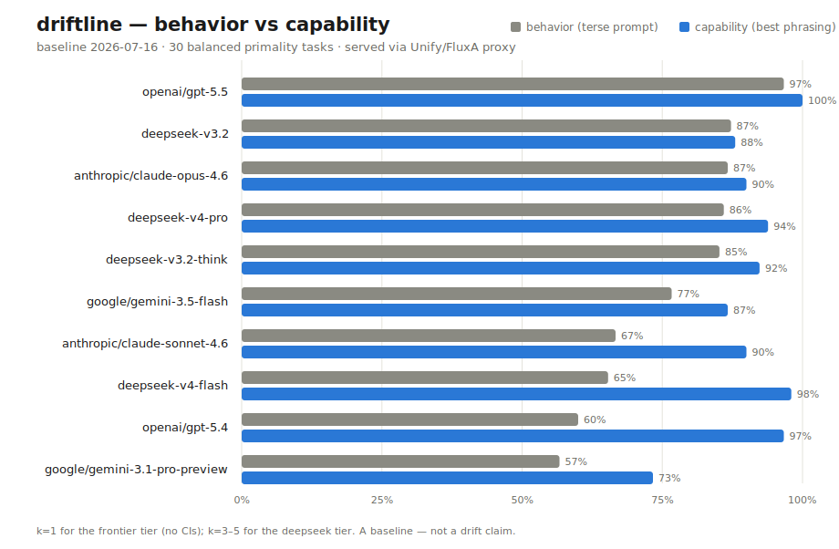

# Baseline — 2026-07-16

First real run. Ten models on the full 30-task balanced primality set, served
through the Unify/FluxA proxy. Six frontier models at k=1 (terse + step-by-step);
four deepseek open-weight models at k=3–5 (two terse phrasings). ~720 graded
calls. Raw responses are all in `runs/2026-07-16/`. minimax and kimi were skipped
(upstream 502s, a provider outage — not rate-limiting); glm/ernie skipped as
thinking-only models that starve `content` even at 4096 tokens.



**This is a baseline, not a drift measurement.** One time point cannot show drift;
that needs a second run to compare against. Nothing here is called drift. Read the
numbers as "the structure the instrument sees on day one," not "model X is
good/bad." The frontier tier is k=1 (point estimates, no CIs).

## Behavior vs capability

| model | behavior (terse) | capability | answer bias (yes) | recall+ / recall− |
|---|---|---|---|---|
| openai/gpt-5.5 | 96.7% | 100.0% | 53% (balanced) | 100% / 93% |
| deepseek-v3.2 | 87.2% | 88.0% | 62% (→prime) | 99% / 76% |
| anthropic/claude-opus-4.6 | 86.7% | 90.0% | 63% (→prime) | 100% / 73% |
| deepseek-v4-pro | 86.0% | 93.9% | 67% (→prime) | 100% / 70% |
| deepseek-v3.2-think | 85.2% | 92.3% | 60% (→prime) | 92% / 78% |
| google/gemini-3.5-flash | 76.7% | 86.7% | 27% (→not-prime) | 53% / 100% |
| anthropic/claude-sonnet-4.6 | 66.7% | 90.0% | 83% (→prime) | 100% / 33% |
| deepseek-v4-flash | 65.3% | 98.0% | 85% (→prime) | 100% / 31% |
| openai/gpt-5.4 | 60.0% | 96.7% | 30% (→not-prime) | 40% / 80% |
| google/gemini-3.1-pro-preview | 56.7% | 73.3% | 57% (balanced) | 67% / 47% |

`behavior` = accuracy on the terse canonical prompt (what a user types).
`capability` = best paraphrase's mean accuracy over samples (de-saturated
2026-07-16d; the frontier tier is k=1 so its capability still behaves like a max).

## What day one shows

**The 2023 confound is alive in 2026.** Score gpt-5.4 the way the original
["GPT-4 is getting worse"](https://news.ycombinator.com/item?id=36815594) paper did
— terse prompt, primes only — and you get 40% (the recall+ column). It looks broken.
Its actual capability is 96.7%. The gap between the terse behavior and the reasoned
capability is exactly the artifact that made the 2023 paper wrong, reproduced here in
live data by an instrument built to separate the two.

**Vendor answer-priors diverge sharply.** On the terse prompt, Anthropic's models
lean toward calling a number prime (bias 63–83% yes) while OpenAI's and Google's
cheaper models lean the other way (27–30% yes). That is a prior, not a capability —
and telling those apart is the entire point of balanced classes plus a separate
answer-bias metric. A prime-only test set could not see it.

**Snapshot swap detection is blind here.** Through this proxy path, all six vendors
echo the requested alias rather than returning a dated snapshot, so a silent
alias→weights swap could not be detected from the returned model string. Recorded as
a limitation, not worked around.

## Reproduce

```bash
python3 scripts/report.py --date 2026-07-16   # re-score from raw responses
```

Or throw out our graders entirely and score `runs/2026-07-16/*/*.json` yourself.
That is the point (METHODOLOGY.md Rule 5).

## Honest limits on this run

- **Mixed sampling.** The frontier tier is k=1 (point estimates, no CIs — Rule 7
  not satisfied for those six); the deepseek tier is k=3–5 with bootstrap CIs. The
  large behavior/capability gaps (20–37 pts) are almost certainly real; individual
  k=1 point values are noisy.
- **`capability` de-saturated (2026-07-16d), with a residual k=1 limit** — the
  metric now has resolution below 100%, but only for k≥2 runs; the frontier tier at
  k=1 still behaves like the old max. See METHODOLOGY.md § Known defects.
- **Proxy-served.** See METHODOLOGY.md § The proxy caveat.
- **30 tasks, one domain.** Small and narrow by design for a first run.
- **Coverage gap.** minimax/kimi upstreams were down; glm/ernie starve content —
  so the open-weight tier is deepseek-only this run.
